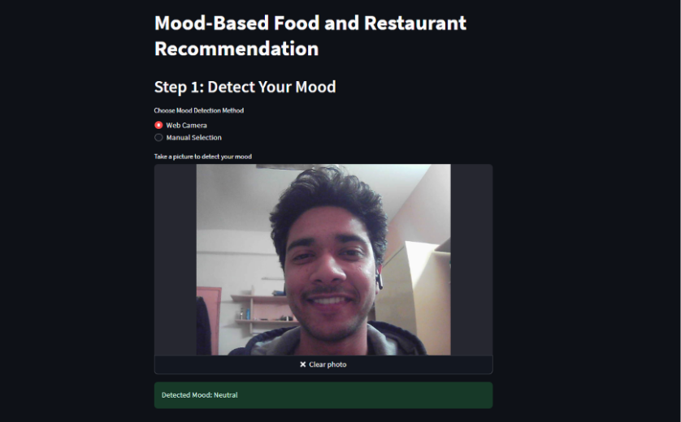
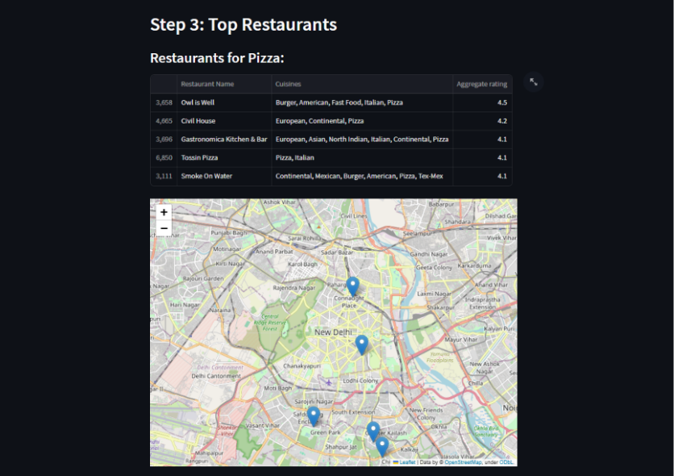
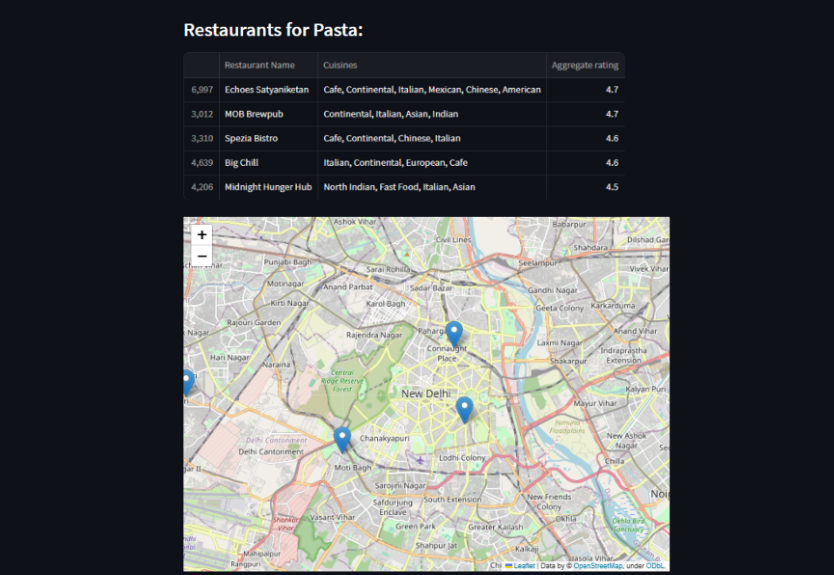

# Mood-Based Food and Restaurant Recommendation System

## Overview
This project is an interactive web application that recommends food and restaurants based on the user's current emotional state. The system uses computer vision and deep learning to detect emotions from facial expressions through a webcam, or allows manual mood selection, and provides personalized food and restaurant recommendations in New Delhi.

## Project Screenshots

### Web Interface

*Main interface of the application showing emotion detection options*

### Restaurant Clustering

*K-means clustering visualization of restaurants in New Delhi*

### Cuisine Analysis

*Distribution of top cuisines available in the dataset*

### Location Mapping

*Interactive map showing recommended restaurant locations*

[Rest of your README content remains the same...]
